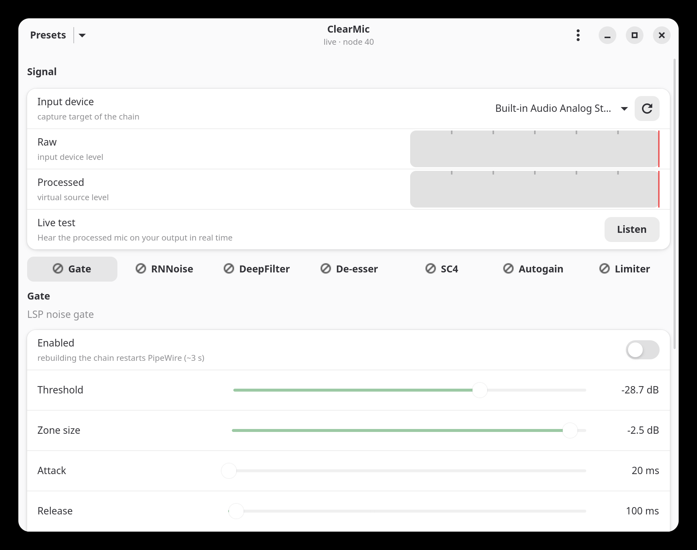
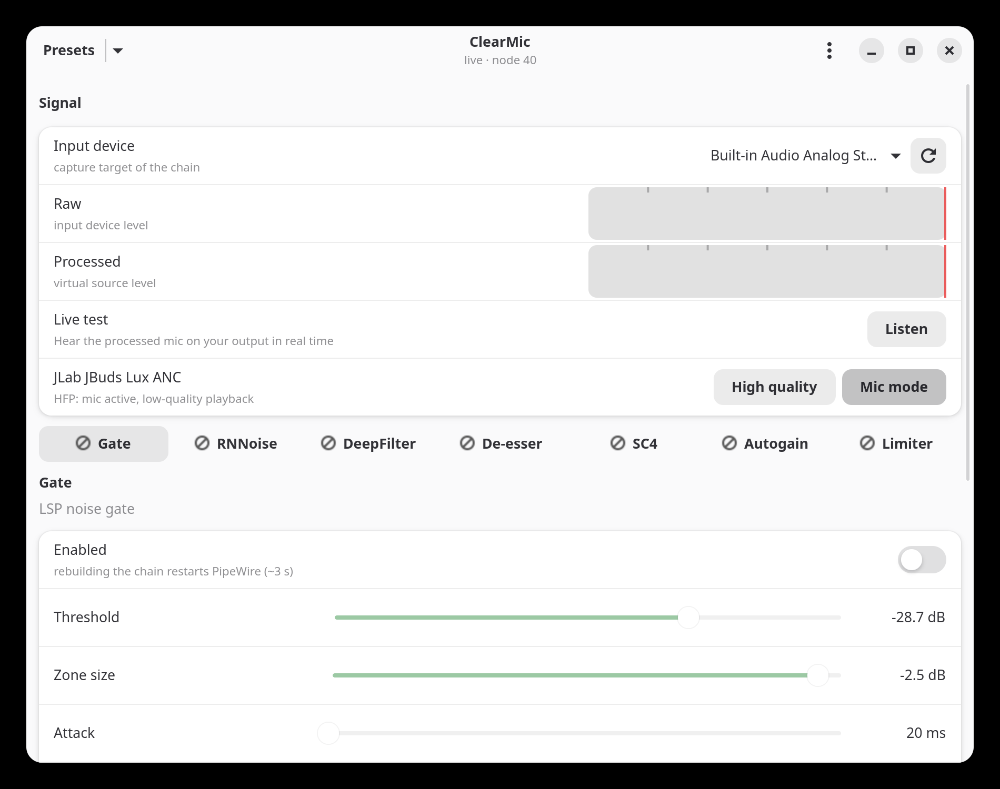
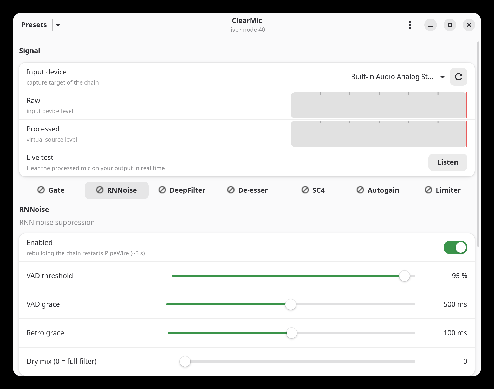

# ClearMic

**A control panel for your microphone's DSP chain — live, inside PipeWire.**

ClearMic is a GTK4/libadwaita app that builds and tunes a native PipeWire
filter-chain for your microphone: noise suppression, de-essing, compression
and automatic gain. Parameters are applied **live** over `pw-cli set-param` —
no restarts, no dropouts — while structural changes regenerate the config
and restart PipeWire for you.

Built following the GNOME Human Interface Guidelines: Adw.ToolbarView,
ViewSwitcher tabs, PreferencesGroup rows, toasts, and a proper About dialog.

## The chain

```
input device → gate → RNNoise / DeepFilterNet → de-esser → SC4 compressor
            → autogain → limiter → virtual source ("ClearMic")
```

Any app that records from the virtual source gets the processed signal.

## Features

- **Per-stage tuning** — every LADSPA control gets an HIG-friendly slider,
  with dB/literal conversion and sane bounds.
- **Stage toggles** — enable or disable any stage; RNNoise and DeepFilter
  are mutually exclusive, at least one stage stays on.
- **Live apply** — slider tweaks go straight to the running graph
  (`pw-cli set-param`), debounced 300 ms.
- **Level meters** — raw input and processed output, drawn at 30 fps.
- **Live test** — route the processed mic to your speakers in real time
  (with a feedback warning; use headphones).
- **Presets** — save and load full chain snapshots.
- **Bluetooth aware** — headsets dropped by the PipeWire restart are
  reconnected automatically.
- **Logging** — `~/.cache/clearmic/app.log` records what happened, even
  when launched from the desktop.

## Requirements

- Python 3 with PyGObject (`python-gobject`)
- GTK 4 and libadwaita 1.9+
- PipeWire 1.x with `pw-cli`, `pw-dump`, `pw-loopback`
- LADSPA plugins: `rnnoise` (or DeepFilterNet), LSP `sc4_compressor_stereo`,
  LSP `deesser_stereo`, LSP `autogain_stereo`, LSP `limiter_stereo`
  (`ladspa-plugins` / `lsp-plugins` on Arch)

## Install

```sh
git clone https://github.com/richard523/clearmic
cd clearmic
./install.sh          # installs the desktop entry and app icon
./run.sh              # or launch from your app grid
```

On first run ClearMic writes the chain config to
`~/.config/pipewire/pipewire.conf.d/30-clearmic.conf` and restarts
PipeWire. App state lives in `~/.config/clearmic/`.

## Files

| Path | Purpose |
|---|---|
| `main.py` | GTK4/libadwaita app |
| `backend.py` | PipeWire interop (pw-cli/pw-dump/pw-loopback, BT keepalive) |
| `confgen.py` | Generates the filter-chain conf |
| `catalog.py` | Stage catalog (LADSPA introspection, param metadata) |

## License

GPL-3.0-or-later — see [LICENSE](LICENSE).

## Screenshots

**Signal group — chain input, level meters, and per-headset bluetooth modes.**

1. Follow-default mode with the headset in high-quality A2DP — the default.
   No mic exists in this state (bluetooth profile, not a bug); the combo
   subtitle shows what the chain is filtering right now.
   

2. Mic mode: one click flips the headset to HFP. The mic appears
   system-wide, the chain follows it, and playback quality drops —
   the buttons always show the real state.
   

3. Every DSP stage is a tab of live sliders (gate, RNNoise/DeepFilter,
   de-esser, SC4, autogain, limiter) — applied without restarts.
   
